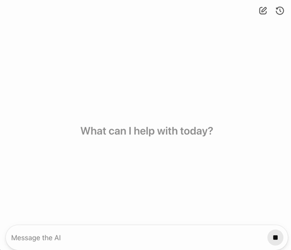

# LangGraph Shopping Assistant

ReAct-based LLM agent with RAG over a product catalog, built with LangGraph and served through an OpenAI ChatKit frontend.

<p>
  
</p>

## Run

```bash
cp .env.example .env   # fill in API keys
docker compose up
```

Open `http://localhost:3000`.

## Structure

```
services/
├── backend/
│   └── src/assistant/
│       ├── api/            # FastAPI app, config, routers
│       ├── graphs/         # LangGraph agent + middleware
│       ├── search/         # Qdrant client, tool definitions
│       ├── ui/             # ChatKit server, widget rendering
│       └── utils/          # DB seeding, Langfuse helpers
└── frontend/
    └── src/                # React + OpenAI ChatKit
config/
    └── qdrant.yaml
docker-compose.yml          # backend, frontend (nginx), qdrant
```
